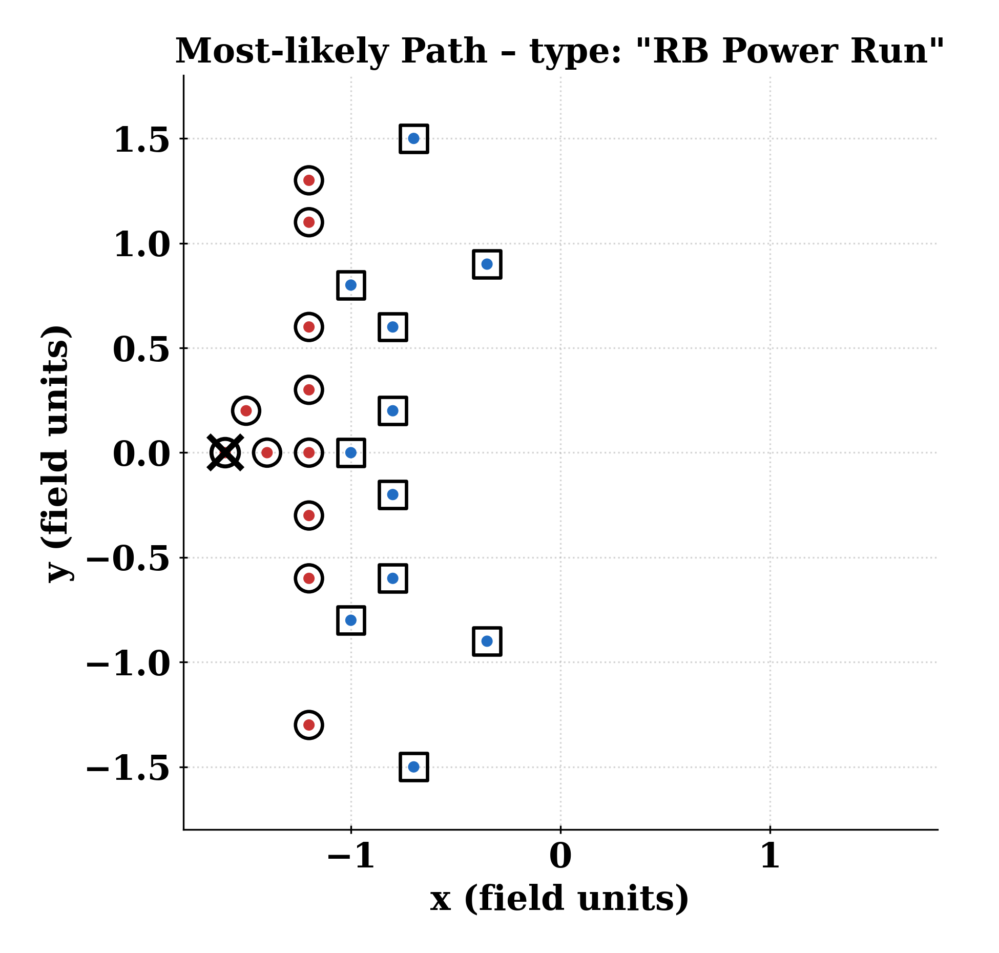
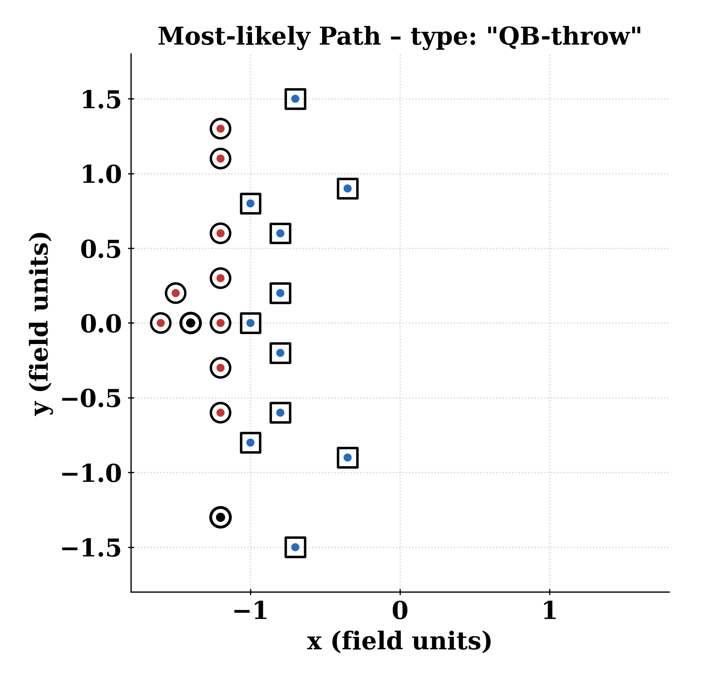
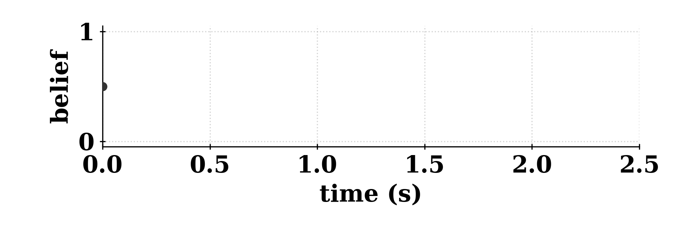

# Solving Football by Exploiting Equilibrium Structure of 2p0s Differential Games with One-Sided Information

This repository contains code and experiments for solving two-player zero-sum (2p0s) games with one-sided incomplete inforamtion. All methods discussed in the paper are implemented in this repository. 

---

## Highlights

Exploiting atomic equilibrium structure of 2p0s one-sided incomplete information differential games allows us to solve a 11v11 American football game within 30 minutes in Mac M1 Pro. Applying SOTA IIEFG algorithms would be computationally infeasible. 

Play Type: "QB Power Run/Push"            | Play Type: "QB-throw"
:----------------------------------------:|:----------------------------------------:
 | 
 | 
Recovers notable _Inside Zone Play_ strategy in football. | Recovers notable _Naked Bootleg Right_ strategy in football.

## Table of Contents

* [Prerequisites](#prerequisites)
* [Environment Setup](#environment-setup)
* [Repository Layout](#repository-layout)
* [Quickstart](#quickstart)
* [Training with CAMS Value Approximation (`our_method`)](#training-with-cams-value-approximation-our_method)
* [Visualizing Trajectories](#visualizing-trajectories)
* [Baselines: DeepCFR & JPSPG](#baselines-deepcfr--jpspg)
* [Multigrid Value Training](#multigrid-value-training)
* [CAMS‑DRL](#camsdrl)
* [RL Baselines on Hexner’s Game](#rl-baselines-on-hexners-game)
* [MPC - 11v11 Football](#mpc---11v11-football)

---

## Prerequisites

* Python ≥ 3.9
* CUDA‑capable GPU recommended for training
* Conda (Anaconda/Miniconda)

---

## Environment Setup

```bash
# 1) Create and activate the environment
conda env create -f env.yml
# Replace with the actual name in env.yml if different
conda activate dg-football

# 2) (Optional) Verify GPU availability
python -c "import torch; print('CUDA visible:', torch.cuda.is_available())"
```

---

## Repository Layout

```
.
├── our_method/
│   ├── train_our_method.sh                 # primal, unconstrained
│   ├── train_our_method_dual.sh            # dual, unconstrained
│   ├── train_our_method_cons.sh            # primal, constrained
│   ├── train_our_method_cons_dual.sh       # dual, constrained
│   ├── train_our_method_3d.sh              # high‑dimensional (3D) variant
│   └── visualization_scripts/              # NOTE: verify folder name; see note below
│       ├── simulation_latest.py
│       ├── simulation_latest_primal_dual.py
│       ├── simulation_latest_cons.py
│       ├── simulation_latest_cons_primal_dual.py
│       └── simulation_latest_for_gt_comparison.py
├── JPSPG/
│   ├── ...incomplete_2d.py                 # normal‑form (2D), incomplete‑information
│   ├── ...2d_multi_stage.py                # 4‑stage game
│   └── trajectory_jpspg.py                 # visualize rollouts (pretrained)
├── CAMS-RL/
│   ├── PPO_pub_belief_trainer.py # train PPO agent in public‑belief setting
│   ├── MMD_pub_belief_trainer.py # train MMD agent in public‑belief setting
│   └── eval_game_pub_belief.py # evaluation scripts
├── Multi-Grid/
│   ├── run_multigrid.py
│   └── run_multigrid_n_cycle.py
├── Multi-Grid/
│   └── football_demo_jax.py
├── IIG-RL-Benchmark/
│   ├── diff_game_main_exp.py
│   └── open_spiel_games/hexners_game_fixed_state.py
├── SOTA_Test_Scripts/
└── env.yml
```

> **Note:** Some notes may reference `visualization_scipts/` (typo). Ensure the actual directory is `visualization_scripts/`, or keep names consistent across code and docs.

---

## Quickstart

Use pre‑trained models to render trajectories.

```bash
cd our_method/visualization_scripts

# Unconstrained (primal)
python simulation_latest.py

# Unconstrained (primal + dual)
python simulation_latest_primal_dual.py

# Constrained (primal)
python simulation_latest_cons.py

# Constrained (primal + dual)
python simulation_latest_cons_primal_dual.py

# 4‑stage game for ground‑truth comparison (DeepCFR / JPSPG baselines)
python simulation_latest_for_gt_comparison.py
```

Each script expects checkpoints at predefined paths. Check the script header.

---

## Training with CAMS Value Approximation (`our_method`)

Train value networks (and induced policies) for different game variants.

```bash
cd our_method

# Primal, unconstrained
bash ./train_our_method.sh

# Dual, unconstrained
bash ./train_our_method_dual.sh

# Primal, constrained
bash ./train_our_method_cons.sh

# Dual, constrained
bash ./train_our_method_cons_dual.sh

# High‑dimensional (3D) case
bash ./train_our_method_3d.sh
```


---

## Visualizing Trajectories

All visualization scripts live in `our_method/visualization_scripts/` and will:

* Load the appropriate checkpoints (primal/dual, constrained/unconstrained, or 4‑stage),
* Simulate rollouts for P1/P2,
* Render trajectory figures/animations.

Adjust rendering options (e.g., FPS, figure size, overlays) by editing constants.

---

## Baselines: DeepCFR & JPSPG

**DeepCFR** (discrete action sizes)

```bash
# |A| = 9
python run_cfr_3.py

# |A| = 16
python run_cfr.py
```

**JPSPG** (normal‑form and 4‑stage)

```bash
cd JPSPG

# Normal‑form (2D) incomplete‑information
a python ...incomplete_2d.py

# 4‑stage multi‑stage game
python ...2d_multi_stage.py

# Visualize trajectories using pretrained P1/P2 policies
python trajectory_jpspg.py
```

---

## Multigrid Value Training

Train value networks with two‑level or N‑level multigrid.

```bash
cd Multi-Grid

# 2‑level multigrid
python run_multigrid.py

# N‑level multigrid (set levels with --kmin/--kmax; require kmin >= 1)
python run_multigrid_n_cycle.py --kmin 1 --kmax 3
```

---

## CAMS‑DRL

Train CAMS‑DRL agents in the public‑belief setting.

```bash
cd CAMS-RL


# PPO agent (public belief)
python PPO_pub_belief_trainer.py 

# MMD agent (public belief)
python MMD_pub_belief_trainer.py 


# Evaluation
python eval_game_pub_belief.py
```

---

## RL Baselines on Hexner’s Game

RL baselines use `IIG-RL-Benchmark`.

```bash
cd IIG-RL-Benchmark
python diff_game_main_exp.py
```

* Environment definition: `open_spiel_games/hexners_game_fixed_state.py`
* Change time discretization or action space there.
* Exploitability is computed with OpenSpiel’s native algorithms.
* Additional evaluation scripts live in `SOTA_Test_Scripts/`.

---

## MPC - 11v11 Football 

Train policies for 11v11 American Football

```bash
cd MPC
python football_demo_jax.py
```
